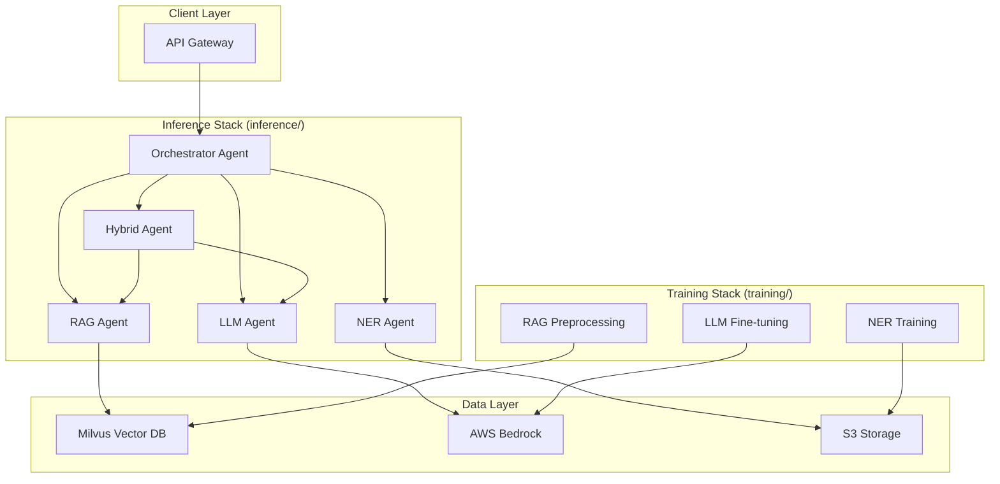

# Design Document

## Overview

The multilingual product inference system is designed as a proof-of-concept agentic workflow that processes product names in English, Thai, or mixed languages using multiple AI inference mechanisms. The system employs a modular architecture with clear separation between training/preprocessing pipelines and inference agents, all deployed on AWS using simple, debuggable infrastructure patterns.

The system consists of two main components:
1. **Training Stack** (`training/` folder) - Handles data preprocessing, model training, and knowledge base preparation
2. **Inference Stack** (`inference/` folder) - Handles real-time product name inference using trained models

## Architecture

### High-Level System Architecture



### Agent Architecture

The system uses the strands-agents SDK to implement a distributed agent architecture:

1. **Orchestrator Agent**: Coordinates parallel execution of inference agents
2. **NER Agent**: Named Entity Recognition for brand/product identification
3. **RAG Agent**: Retrieval-Augmented Generation using vector similarity
4. **LLM Agent**: Direct language model inference using fine-tuned Nova Pro
5. **Hybrid Agent**: Sequential combination of multiple approaches (e.g., NER→RAG→LLM)

## Components and Interfaces

### 1. Orchestrator Agent

**Purpose**: Coordinate parallel execution of inference agents and aggregate results

**Interface**:
```python
class OrchestratorAgent:
    async def process_product_name(self, product_name: str) -> InferenceResult:
        """
        Process product name through multiple inference agents in parallel
        Returns aggregated results with confidence-based ranking
        """
        pass
```

**Key Responsibilities**:
- Accept product name input (English/Thai/mixed)
- Dispatch requests to inference agents in parallel
- Aggregate results and calculate confidence scores
- Return best inference based on highest confidence
- Handle agent failures and timeouts

### 2. NER Agent

**Purpose**: Extract brand entities using Named Entity Recognition

**Interface**:
```python
class NERAgent:
    async def extract_entities(self, product_name: str) -> NERResult:
        """
        Extract brand, category, and variant entities from product name
        Returns entities with confidence scores
        """
        pass
```

**Implementation Details**:
- Uses spaCy with custom trained models for BRAND, CATEGORY, VARIANT entities
- Supports multilingual processing (Thai-English mixed text)
- Fallback to transformer-based NER models (xlm-roberta) for better multilingual support
- Returns structured entities with confidence scores

### 3. RAG Agent

**Purpose**: Retrieve similar products and infer brands using vector similarity

**Interface**:
```python
class RAGAgent:
    async def retrieve_and_infer(self, product_name: str) -> RAGResult:
        """
        Retrieve similar products from vector DB and infer brand
        Returns brand prediction with similarity scores
        """
        pass
```

**Implementation Details**:
- Uses sentence transformers for embedding generation (paraphrase-multilingual-MiniLM-L12-v2)
- Queries Milvus vector database for top-k similar products
- Applies similarity-based brand inference
- Supports fuzzy matching for misspellings and transliterations

### 4. LLM Agent

**Purpose**: Direct brand inference using fine-tuned language models

**Interface**:
```python
class LLMAgent:
    async def infer_brand(self, product_name: str) -> LLMResult:
        """
        Infer brand using fine-tuned Nova Pro model via Bedrock
        Returns brand prediction with confidence score
        """
        pass
```

**Implementation Details**:
- Uses fine-tuned Nova Pro model via AWS Bedrock
- Supports on-demand inference for cost efficiency
- Handles multilingual input with context-aware prompting
- Returns structured brand predictions with confidence

### 5. Hybrid Agent

**Purpose**: Sequential combination of multiple inference approaches

**Interface**:
```python
class HybridAgent:
    async def hybrid_inference(self, product_name: str) -> HybridResult:
        """
        Sequential processing: NER → RAG → LLM pipeline
        Returns enhanced prediction using multiple approaches
        """
        pass
```

**Implementation Details**:
- Executes NER first to identify potential brand entities
- Uses NER results to enhance RAG retrieval relevance
- Passes enriched context to LLM for final prediction
- Combines confidence scores from all stages

## Data Models

### Core Data Structures

```python
@dataclass
class ProductInput:
    product_name: str
    language_hint: Optional[str] = None  # 'en', 'th', 'mixed'
    
@dataclass
class EntityResult:
    entity_type: str  # 'BRAND', 'CATEGORY', 'VARIANT'
    text: str
    confidence: float
    start_pos: int
    end_pos: int

@dataclass
class NERResult:
    entities: List[EntityResult]
    confidence: float
    processing_time: float

@dataclass
class RAGResult:
    predicted_brand: str
    similar_products: List[Dict]
    confidence: float
    processing_time: float

@dataclass
class LLMResult:
    predicted_brand: str
    reasoning: str
    confidence: float
    processing_time: float

@dataclass
class HybridResult:
    predicted_brand: str
    ner_contribution: float
    rag_contribution: float
    llm_contribution: float
    confidence: float
    processing_time: float

@dataclass
class InferenceResult:
    input_product: str
    ner_result: NERResult
    rag_result: RAGResult
    llm_result: LLMResult
    hybrid_result: HybridResult
    best_prediction: str
    best_confidence: float
    best_method: str
    total_processing_time: float
```

### Vector Database Schema (Milvus)

```python
# Collection schema for product embeddings
collection_schema = {
    "fields": [
        {"name": "id", "type": "int64", "is_primary": True},
        {"name": "product_name", "type": "varchar", "max_length": 1000},
        {"name": "brand", "type": "varchar", "max_length": 200},
        {"name": "category", "type": "varchar", "max_length": 200},
        {"name": "sub_category", "type": "varchar", "max_length": 200},
        {"name": "embedding", "type": "float_vector", "dim": 384}  # sentence transformer dim
    ]
}
```

## Error Handling

### Agent-Level Error Handling

1. **Timeout Management**: Each agent has configurable timeout limits
2. **Fallback Strategies**: Graceful degradation when agents fail
3. **Retry Logic**: Exponential backoff for transient failures
4. **Circuit Breaker**: Prevent cascade failures across agents

### System-Level Error Handling

1. **Input Validation**: Sanitize and validate product names
2. **Resource Limits**: Prevent resource exhaustion
3. **Monitoring**: Comprehensive logging and metrics
4. **Health Checks**: Regular agent health monitoring

```python
class ErrorHandler:
    async def handle_agent_failure(self, agent_name: str, error: Exception) -> Optional[Any]:
        """Handle individual agent failures with fallback strategies"""
        pass
    
    async def validate_input(self, product_name: str) -> bool:
        """Validate and sanitize input product names"""
        pass
```

## Testing Strategy

### Unit Testing

1. **Agent Testing**: Individual agent functionality and interfaces
2. **Model Testing**: Validate inference accuracy and performance
3. **Data Pipeline Testing**: Ensure preprocessing and training pipelines work correctly

### Integration Testing

1. **End-to-End Workflows**: Complete inference pipeline testing
2. **Agent Communication**: Inter-agent messaging and coordination
3. **AWS Integration**: Bedrock, Milvus, and ECS integration testing

### Performance Testing

1. **Load Testing**: Concurrent request handling
2. **Latency Testing**: Response time optimization
3. **Accuracy Testing**: Inference quality across different product types

### Local Testing Framework

```python
class LocalTestFramework:
    def setup_mock_services(self):
        """Setup local mock services for testing"""
        pass
    
    def run_inference_tests(self):
        """Run comprehensive inference accuracy tests"""
        pass
    
    def benchmark_performance(self):
        """Benchmark agent performance and latency"""
        pass
```

## Deployment Architecture

### AWS Infrastructure Components

1. **ECS Fargate**: Containerized agent deployment
2. **Application Load Balancer**: Request routing and health checks
3. **CloudWatch**: Logging and monitoring
4. **S3**: Model artifacts and training data storage
5. **Milvus on ECS**: Vector database deployment
6. **AWS Bedrock**: LLM fine-tuning and inference

### Container Architecture

```dockerfile
# Base agent container structure for ARM64 platform
FROM --platform=linux/arm64 python:3.13-slim

# Install dependencies
COPY requirements.txt .
RUN pip install -r requirements.txt

# Copy agent code (following PEP 8 standards)
COPY src/ /app/src/
COPY models/ /app/models/

# Health check endpoint
HEALTHCHECK --interval=30s --timeout=10s --start-period=60s \
  CMD curl -f http://localhost:8080/health || exit 1

CMD ["python", "/app/src/agent_main.py"]
```

### Infrastructure as Code

```yaml
# CloudFormation template structure
Resources:
  ECSCluster:
    Type: AWS::ECS::Cluster
    Properties:
      ClusterName: multilingual-inference-cluster
      
  OrchestratorTaskDef:
    Type: AWS::ECS::TaskDefinition
    Properties:
      Family: orchestrator-agent
      Cpu: 1024
      Memory: 2048
      RuntimePlatform:
        CpuArchitecture: ARM64
        OperatingSystemFamily: LINUX
      RequiresCompatibilities:
        - FARGATE
      
  OrchestratorService:
    Type: AWS::ECS::Service
    Properties:
      Cluster: !Ref ECSCluster
      TaskDefinition: !Ref OrchestratorTaskDef
      DesiredCount: 2
      
  NERTaskDef:
    Type: AWS::ECS::TaskDefinition
    Properties:
      Family: ner-agent
      Cpu: 512
      Memory: 1024
      RuntimePlatform:
        CpuArchitecture: ARM64
        OperatingSystemFamily: LINUX
      RequiresCompatibilities:
        - FARGATE
      
  NERService:
    Type: AWS::ECS::Service
    Properties:
      Cluster: !Ref ECSCluster
      TaskDefinition: !Ref NERTaskDef
      DesiredCount: 1
      
  # Additional services for RAG, LLM, Hybrid agents with ARM64 platform
```

## Configuration Management

### Environment-Based Configuration

```python
@dataclass
class AgentConfig:
    # Model configurations
    ner_model_path: str
    sentence_transformer_model: str
    bedrock_model_id: str
    
    # Infrastructure configurations
    milvus_host: str
    milvus_port: int
    aws_region: str
    
    # Performance configurations
    timeout_seconds: int
    max_concurrent_requests: int
    confidence_threshold: float
    
    @classmethod
    def from_environment(cls) -> 'AgentConfig':
        """Load configuration from environment variables"""
        pass
```

### Model Switching Configuration

```python
class ModelRegistry:
    def register_ner_model(self, name: str, model_path: str):
        """Register alternative NER models"""
        pass
    
    def register_embedding_model(self, name: str, model_name: str):
        """Register alternative embedding models"""
        pass
    
    def switch_model(self, model_type: str, model_name: str):
        """Switch to different model configuration"""
        pass
```

## Code Quality Standards

### PEP 8 Compliance

All Python code in the system follows PEP 8 coding standards to ensure consistency and maintainability:

1. **Code Formatting**: Use of tools like `black` and `flake8` for automated formatting and linting
2. **Naming Conventions**: Snake_case for functions and variables, PascalCase for classes
3. **Import Organization**: Grouped imports (standard library, third-party, local) with proper spacing
4. **Documentation**: Comprehensive docstrings following PEP 257 conventions
5. **Type Hints**: Use of type annotations for better code clarity and IDE support

### Development Environment

The system requires Python 3.13 in a `.venv` virtual environment for consistent development:

```bash
# Setup .venv virtual environment
python3.13 -m venv .venv
source .venv/bin/activate  # On macOS/Linux
# .venv\Scripts\activate  # On Windows

# Install dependencies
pip install -r requirements.txt
```

```python
# Example of PEP 8 compliant code structure
from typing import Optional, List, Dict
import asyncio
import logging

from dataclasses import dataclass
from abc import ABC, abstractmethod

logger = logging.getLogger(__name__)


@dataclass
class InferenceConfig:
    """Configuration class for inference agents following PEP 8 standards."""
    
    model_path: str
    confidence_threshold: float
    timeout_seconds: int = 30
    
    def validate(self) -> bool:
        """Validate configuration parameters."""
        return (
            self.confidence_threshold >= 0.0 
            and self.timeout_seconds > 0
        )


class BaseAgent(ABC):
    """Abstract base class for all inference agents."""
    
    def __init__(self, config: InferenceConfig) -> None:
        """Initialize agent with configuration."""
        self.config = config
        self.logger = logging.getLogger(self.__class__.__name__)
    
    @abstractmethod
    async def process(self, input_text: str) -> Dict:
        """Process input text and return inference results."""
        pass
```

### Platform Architecture

The system is designed for ARM64 platform deployment on AWS:

1. **Container Images**: All Docker images built for `linux/arm64` platform
2. **ECS Tasks**: Configured with ARM64 CPU architecture for cost efficiency
3. **Performance**: Optimized for ARM64 Graviton processors on AWS
4. **Compatibility**: All dependencies verified for ARM64 compatibility

This design provides a robust, modular, and easily debuggable foundation for the multilingual product inference system, with clear separation of concerns, PEP 8 code quality standards, and ARM64-optimized deployment patterns suitable for a proof-of-concept implementation.