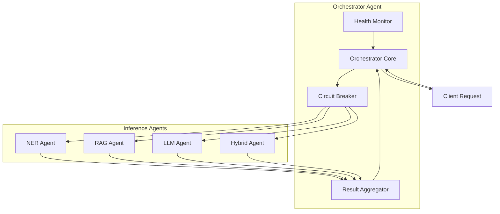

# Orchestrator Agent Documentation

## Overview

The Orchestrator Agent is the central coordination component of the multilingual product inference system. It manages parallel execution of multiple inference agents (NER, RAG, LLM, and Hybrid) using the strands-agents SDK framework, providing comprehensive error handling, timeout management, and result aggregation with confidence-based ranking.

## Features

### Core Functionality
- **Parallel Agent Execution**: Coordinates multiple inference agents simultaneously for optimal performance
- **Result Aggregation**: Combines results from all agents and selects the best prediction based on confidence scores
- **Error Handling**: Graceful degradation when individual agents fail
- **Circuit Breaker Pattern**: Prevents cascade failures and provides automatic recovery
- **Health Monitoring**: Comprehensive health checks for all registered agents
- **Timeout Management**: Configurable timeouts for individual agents and overall operations

### Agent Coordination
- **Dynamic Agent Registration**: Register and unregister agents at runtime
- **Custom Timeouts**: Individual timeout settings per agent
- **Confidence Thresholding**: Filter predictions below configurable confidence levels
- **Best Prediction Selection**: Automatic selection of highest confidence result

## Architecture



## Usage

### Basic Usage

```python
from inference.agents.orchestrator_agent import create_orchestrator_agent
from inference.models.data_models import ProductInput, LanguageHint

# Create orchestrator with configuration
orchestrator = create_orchestrator_agent({
    "timeout_seconds": 30.0,
    "confidence_threshold": 0.5,
    "circuit_breaker_threshold": 3,
    "circuit_breaker_timeout": 60.0
})

# Initialize orchestrator
await orchestrator.initialize()

# Register agents (assuming you have agent instances)
orchestrator.register_agent("ner", ner_agent, timeout=10.0)
orchestrator.register_agent("rag", rag_agent, timeout=15.0)
orchestrator.register_agent("llm", llm_agent, timeout=20.0)

# Process product input
input_data = ProductInput(
    product_name="iPhone 15 Pro Max 256GB",
    language_hint=LanguageHint.ENGLISH
)

# Execute orchestrated inference
result = await orchestrator.orchestrate_inference(input_data)

# Access results
print(f"Best prediction: {result.best_prediction}")
print(f"Confidence: {result.best_confidence}")
print(f"Method: {result.best_method}")
print(f"Processing time: {result.total_processing_time}s")

# Cleanup
await orchestrator.cleanup()
```

### Advanced Configuration

```python
# Advanced orchestrator configuration
config = {
    "timeout_seconds": 30.0,           # Default agent timeout
    "max_parallel_agents": 4,          # Maximum concurrent agents
    "confidence_threshold": 0.7,       # Minimum confidence for predictions
    "circuit_breaker_threshold": 5,    # Failures before circuit opens
    "circuit_breaker_timeout": 120.0   # Circuit breaker reset timeout
}

orchestrator = create_orchestrator_agent(config)
```

### Health Monitoring

```python
# Check health of all registered agents
health_results = await orchestrator.get_agent_health()

for agent_name, health in health_results.items():
    print(f"{agent_name}: {'Healthy' if health.is_healthy else 'Unhealthy'}")
    if health.error_message:
        print(f"  Error: {health.error_message}")
    if health.response_time:
        print(f"  Response time: {health.response_time:.3f}s")

# Check orchestrator's own health
orchestrator_health = await orchestrator.health_check()
print(f"Orchestrator: {'Healthy' if orchestrator_health.is_healthy else 'Unhealthy'}")
```

## Configuration Options

### Orchestrator Configuration

| Parameter | Type | Default | Description |
|-----------|------|---------|-------------|
| `timeout_seconds` | float | 30.0 | Default timeout for agent operations |
| `max_parallel_agents` | int | 4 | Maximum number of concurrent agents |
| `confidence_threshold` | float | 0.5 | Minimum confidence for valid predictions |
| `circuit_breaker_threshold` | int | 5 | Failures before circuit breaker opens |
| `circuit_breaker_timeout` | float | 60.0 | Time before circuit breaker reset attempt |

### Agent Registration Options

```python
# Register agent with custom timeout
orchestrator.register_agent(
    agent_name="custom_agent",
    agent=agent_instance,
    timeout=25.0  # Custom timeout for this agent
)

# Unregister agent
orchestrator.unregister_agent("custom_agent")
```

## Error Handling

### Circuit Breaker Pattern

The orchestrator implements a circuit breaker pattern to handle agent failures:

1. **Closed State**: Normal operation, all requests pass through
2. **Open State**: Agent has failed threshold times, requests are blocked
3. **Half-Open State**: After timeout, allows test requests to check recovery

```python
# Circuit breaker states are managed automatically
# Check if agent is available
is_available = orchestrator._is_agent_available("agent_name")

# Circuit breaker state information
circuit_state = orchestrator.circuit_breaker_states["agent_name"]
print(f"State: {circuit_state['state']}")
print(f"Failure count: {circuit_state['failure_count']}")
```

### Graceful Degradation

When agents fail, the orchestrator continues with available agents:

```python
# Even if some agents fail, orchestrator returns results from successful agents
result = await orchestrator.orchestrate_inference(input_data)

# Check which agents succeeded
if result.ner_result is None:
    print("NER agent failed")
if result.rag_result is None:
    print("RAG agent failed")
# etc.
```

## Result Aggregation

### Best Prediction Selection

The orchestrator selects the best prediction using the following logic:

1. **Confidence Filtering**: Only consider predictions above `confidence_threshold`
2. **Highest Confidence**: Select prediction with highest confidence score
3. **Fallback**: If no predictions meet threshold, return "unknown" with 0.0 confidence

```python
# Example result structure
result = InferenceResult(
    input_product="iPhone 15 Pro",
    ner_result=NERResult(...),      # Individual agent results
    rag_result=RAGResult(...),
    llm_result=LLMResult(...),
    hybrid_result=HybridResult(...),
    best_prediction="Apple",         # Best prediction selected
    best_confidence=0.95,           # Highest confidence score
    best_method="ner",              # Method that produced best result
    total_processing_time=0.234     # Total orchestration time
)
```

### Confidence Scoring

Each agent provides confidence scores that the orchestrator uses for selection:

- **NER Agent**: Based on entity recognition confidence
- **RAG Agent**: Based on similarity scores from vector search
- **LLM Agent**: Based on model output confidence
- **Hybrid Agent**: Combined confidence from multiple approaches

## Performance Considerations

### Parallel Execution

The orchestrator executes agents in parallel for optimal performance:

```python
# All agents execute simultaneously
tasks = {
    "ner": asyncio.create_task(ner_agent.process(input_data)),
    "rag": asyncio.create_task(rag_agent.process(input_data)),
    "llm": asyncio.create_task(llm_agent.process(input_data))
}

# Wait for all to complete
results = await asyncio.gather(*tasks.values(), return_exceptions=True)
```

### Timeout Management

Individual agent timeouts prevent slow agents from blocking the entire pipeline:

```python
# Agent-specific timeouts
orchestrator.register_agent("fast_agent", agent1, timeout=5.0)
orchestrator.register_agent("slow_agent", agent2, timeout=30.0)
```

## Integration with Strands-Agents SDK

The orchestrator is built on the strands-agents framework:

```python
from strands_agents import Agent, AgentMessage, AgentContext

class StrandsOrchestratorAgent(OrchestratorAgent, Agent):
    """Orchestrator implementation using strands-agents framework."""
    
    def __init__(self, config: Optional[Dict[str, Any]] = None):
        # Initialize both base classes
        BaseAgent.__init__(self, "orchestrator", config or {})
        Agent.__init__(self)
```

### Agent Communication

The orchestrator handles inter-agent communication and message passing:

```python
# Process method integrates with strands-agents
async def process(self, input_data: ProductInput) -> Dict[str, Any]:
    result = await self.orchestrate_inference(input_data)
    return {
        "inference_result": result,
        "agent_health": await self.get_agent_health()
    }
```

## Testing

### Unit Tests

The orchestrator includes comprehensive unit tests:

```bash
# Run orchestrator tests
python -m pytest tests/test_orchestrator_agent.py -v

# Run specific test categories
python -m pytest tests/test_orchestrator_agent.py::TestParallelInference -v
python -m pytest tests/test_orchestrator_agent.py::TestCircuitBreaker -v
python -m pytest tests/test_orchestrator_agent.py::TestHealthMonitoring -v
```

### Integration Tests

End-to-end integration tests verify complete workflows:

```python
# Example integration test
@pytest.mark.integration
async def test_complete_inference_workflow():
    orchestrator = create_orchestrator_agent(config)
    
    # Register all agents
    for name, agent in agents.items():
        orchestrator.register_agent(name, agent)
    
    await orchestrator.initialize()
    
    # Test inference
    result = await orchestrator.orchestrate_inference(test_input)
    
    # Verify results
    assert result.best_prediction != "unknown"
    assert result.best_confidence > 0.0
    assert result.total_processing_time > 0.0
```

### Demo Script

Run the demonstration script to see the orchestrator in action:

```bash
python -m examples.orchestrator_demo
```

## Troubleshooting

### Common Issues

1. **Agent Registration Errors**
   ```python
   # Ensure agents are properly initialized before registration
   await agent.initialize()
   orchestrator.register_agent("agent_name", agent)
   ```

2. **Circuit Breaker Issues**
   ```python
   # Check circuit breaker state
   state = orchestrator.circuit_breaker_states["agent_name"]
   if state["state"] == "open":
       print("Agent is circuit-broken, waiting for recovery")
   ```

3. **Timeout Problems**
   ```python
   # Adjust timeouts for slow agents
   orchestrator.register_agent("slow_agent", agent, timeout=60.0)
   ```

### Debugging

Enable debug logging for detailed orchestrator behavior:

```python
import logging
logging.getLogger("inference.agents.orchestrator_agent").setLevel(logging.DEBUG)
```

### Health Check Failures

If health checks fail, verify agent configuration:

```python
# Check agent configuration
health = await orchestrator.get_agent_health()
for name, status in health.items():
    if not status.is_healthy:
        print(f"Agent {name} unhealthy: {status.error_message}")
```

## Best Practices

1. **Agent Initialization**: Always initialize agents before registering with orchestrator
2. **Error Handling**: Implement proper error handling in custom agents
3. **Timeout Configuration**: Set appropriate timeouts based on agent complexity
4. **Health Monitoring**: Regularly check agent health in production
5. **Circuit Breaker Tuning**: Adjust circuit breaker thresholds based on failure patterns
6. **Resource Cleanup**: Always call cleanup() when done with orchestrator

## Future Enhancements

- **Load Balancing**: Multiple instances of the same agent type
- **Priority Queuing**: Priority-based agent execution
- **Caching**: Result caching for repeated queries
- **Metrics Collection**: Detailed performance metrics and monitoring
- **Dynamic Configuration**: Runtime configuration updates without restart